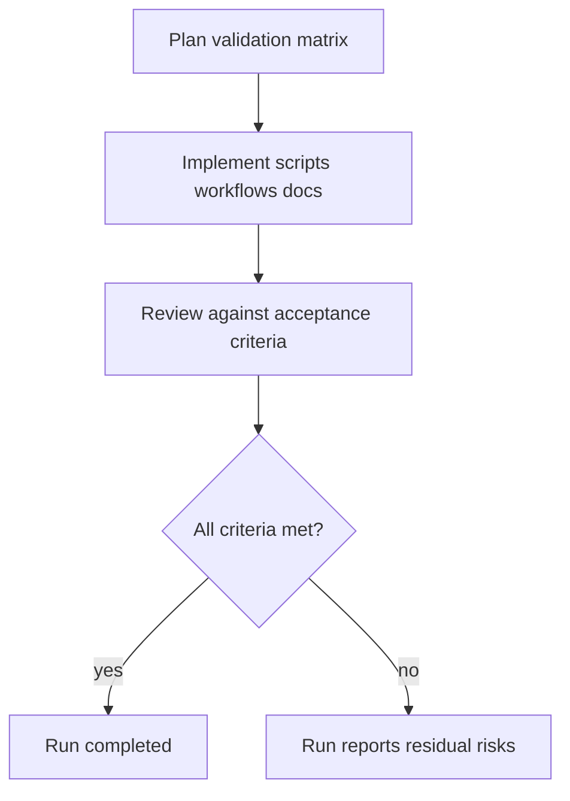

```mermaid
flowchart TD
  A[Plan validation matrix] --> B[Implement scripts workflows docs]
  B --> C[Review against acceptance criteria]
  C --> D{All criteria met?}
  D -- yes --> E[Run completed]
  D -- no --> F[Run reports residual risks]
```
