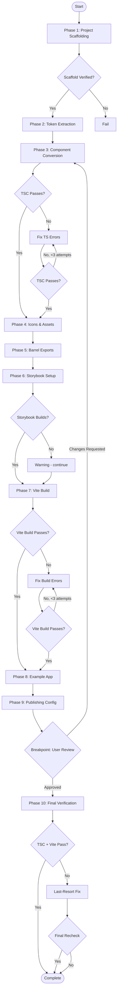

```mermaid
flowchart TD
    Start([Start]) --> P1[Phase 1: Project Scaffolding]
    P1 --> V1{Scaffold Verified?}
    V1 -->|Yes| P2[Phase 2: Token Extraction]
    V1 -->|No| FAIL1[Fail]

    P2 --> P3[Phase 3: Component Conversion]
    P3 --> TSC1{TSC Passes?}
    TSC1 -->|Yes| P4[Phase 4: Icons & Assets]
    TSC1 -->|No| FIX1[Fix TS Errors]
    FIX1 --> TSC2{TSC Passes?}
    TSC2 -->|Yes| P4
    TSC2 -->|No, <3 attempts| FIX1

    P4 --> P5[Phase 5: Barrel Exports]
    P5 --> P6[Phase 6: Storybook Setup]
    P6 --> SB{Storybook Builds?}
    SB -->|Yes| P7[Phase 7: Vite Build]
    SB -->|No| WARN1[Warning - continue]
    WARN1 --> P7

    P7 --> VB{Vite Build Passes?}
    VB -->|Yes| P8[Phase 8: Example App]
    VB -->|No| FIX2[Fix Build Errors]
    FIX2 --> VB2{Vite Build Passes?}
    VB2 -->|Yes| P8
    VB2 -->|No, <3 attempts| FIX2

    P8 --> P9[Phase 9: Publishing Config]
    P9 --> BP{Breakpoint: User Review}
    BP -->|Approved| P10[Phase 10: Final Verification]
    BP -->|Changes Requested| P3

    P10 --> FV{TSC + Vite Pass?}
    FV -->|Yes| Done([Complete])
    FV -->|No| LASTFIX[Last-Resort Fix]
    LASTFIX --> FV2{Final Recheck}
    FV2 -->|Yes| Done
    FV2 -->|No| Done
```
